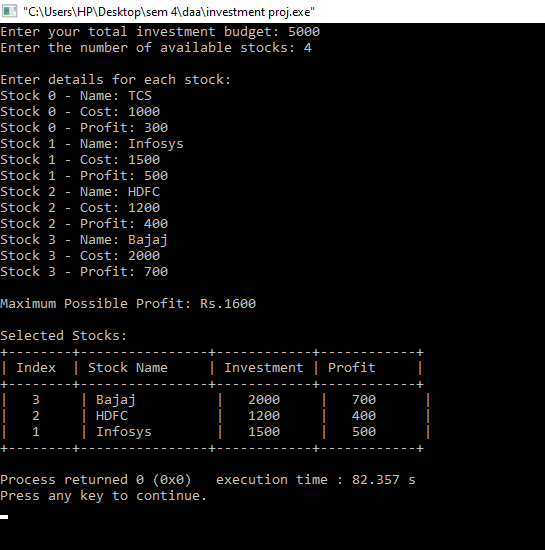

# investment-portfolio-optimization
      
## **Overview**  
This project implements an **investment portfolio optimization** algorithm using the **0/1 Knapsack problem**. It helps investors maximize profit while staying within a given investment budget by selecting the most profitable combination of stocks.  

## **Features**  
- Uses **Dynamic Programming** to solve the **0/1 Knapsack problem** efficiently.  
- Helps in **optimal investment allocation**.  
- Takes **stock name, cost, and profit** as input.  
- Outputs the **maximum profit** and the **selected stocks** for investment.  

## **How It Works**  
The program takes:  
1. The **total budget** available for investment.  
2. The **number of available stocks**.  
3. For each stock:  
   - **Stock name**  
   - **Investment cost**  
   - **Expected profit**  

It then selects the best combination of stocks to maximize profit while staying within budget.  

## **Files Included**  
- `investment_optimization.c` – The main C program.  
- `docs/investment_portfolio_presentation.pptx` – A PowerPoint explaining the project.  

## **How to Run the Program**  
1. **Compile the C program** using any C compiler:  
   ```sh
   gcc investment_optimization.c -o investment
   ```
2. **Run the program**:  
   ```sh
   ./investment
   ```
3. **Enter investment details** when prompted.  
4. The program will display:  
   - The **maximum possible profit**.  
   - The **selected stocks** for investment.  

## **Example Input/Output**  
### **Input Example:**  


## **Contributors**  
- **Deboleena Bhowmik**  
- **Deepanjali Singh**  

## **License**  
This project is open-source under the **MIT License**.  
